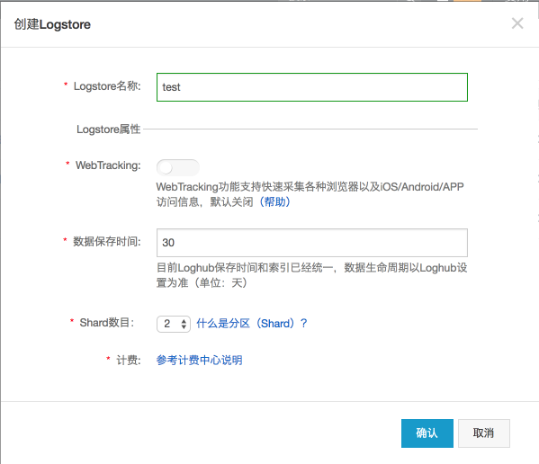
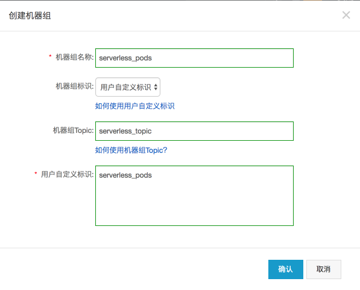
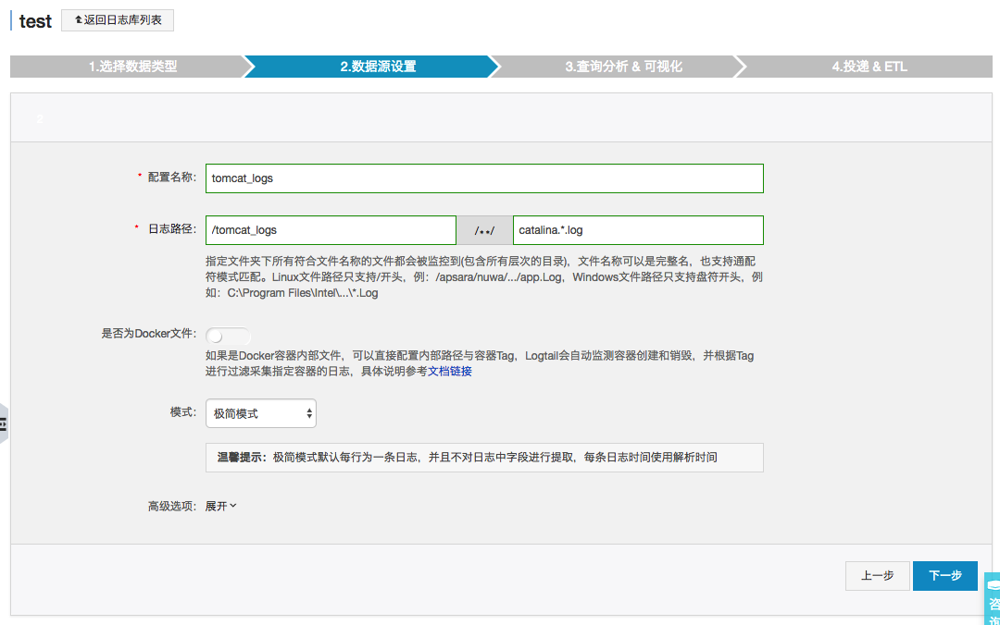
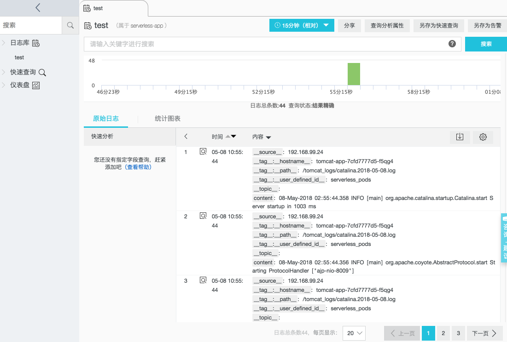

## Gathering log with Sidecar Container

The following document describes the deployment of a Java Web application using Tomcat. And we use a sidecar container to gather log and send to Log Service of Alibaba Cloud.

The details for Pod with Sidecar

https://kubernetes.io/docs/concepts/workloads/pods/pod-overview/

## Prequesite


#### Create Project


#### Create Logstore




#### Create Machine Group



NOTE: The User-defined Identity will be used for Serverless Kubernetes Pod Identification.

#### Config Logstore

* Select the "Other Sources" -> "Text"
* Config Data Source as following




* Apply to Machine Group just created

  ​

## Test It Out

Deploy application

```
kubectl apply -f logs-sidecar.yaml
```

Check status of the deployments/pods/services:

```
kubectl get deployment tomcat-app
kubectl get pod -l app=tomcat-app
```

Access the log from sample application




Delete application


```
kubectl delete -f logs-sidecar.yaml
```

